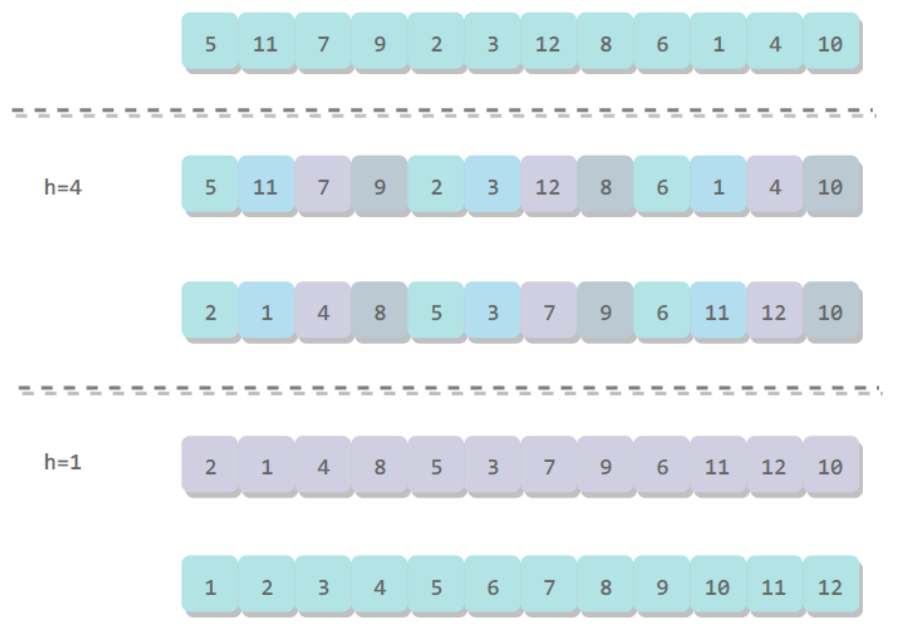
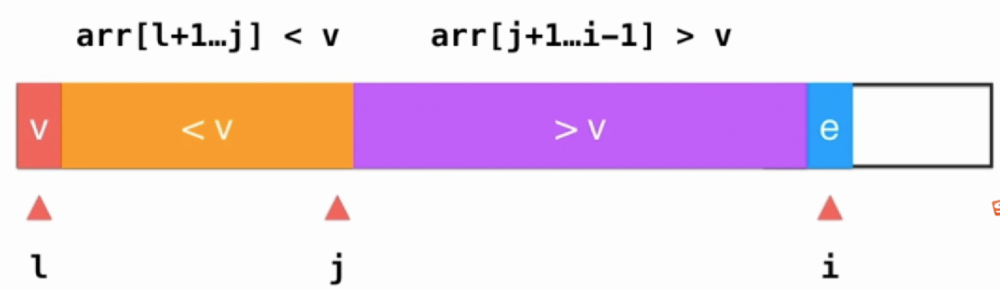
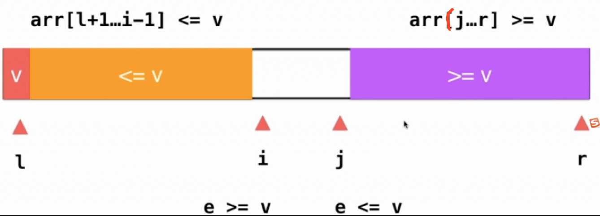
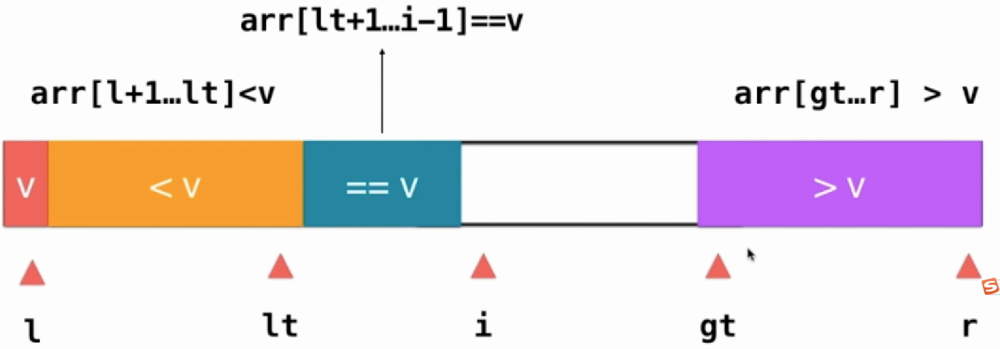
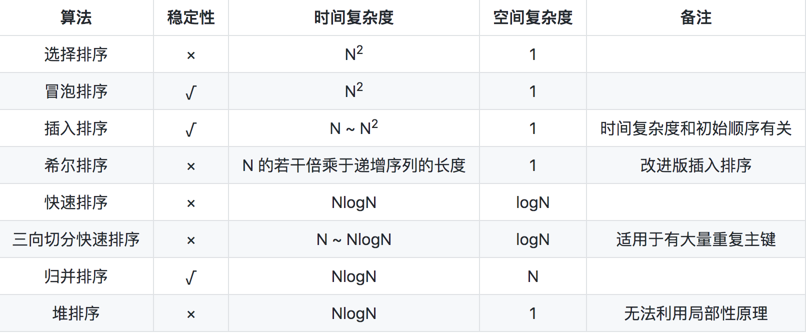

<!-- TOC -->

- [排序算法](#排序算法)
    - [选择排序](#选择排序)
    - [冒泡排序](#冒泡排序)
    - [插入排序](#插入排序)
    - [希尔排序](#希尔排序)
    - [堆排序](#堆排序)
    - [快速排序](#快速排序)
        - [单路遍历](#单路遍历)
        - [待优化点](#待优化点)
        - [优化1:双路遍历](#优化1双路遍历)
        - [三路排序](#三路排序)
        - [总结](#总结)
        - [如何求一个数组的中的第n大的数？](#如何求一个数组的中的第n大的数)
    - [归并排序](#归并排序)
        - [递归法（自顶向下）](#递归法自顶向下)
        - [自底向上迭代法](#自底向上迭代法)
        - [如何求一个数组中的逆序对？](#如何求一个数组中的逆序对)
    - [排序算法比较](#排序算法比较)

<!-- /TOC -->

## 排序算法
**约定:**  
为了支持对不同类型元素的排序，定义抽象类如下,待排序元素需要实现`Comparable`接口，因为排序时需要用到其`comparteTo`方法来比较元素的大小。
``` java
public abstract class Sort<T extends Comparable<T>>
{
    public abstract void sort(T[] arr);

    protected boolean less(T t, T w)
    {
        return t.compareTo(w) < 0;
    }

    protected void swap(T[] arr, int i, int j)
    {
        T temp = arr[i];
        arr[i] = arr[j];
        arr[j] = temp;
    }
}
```

### 选择排序
从数组中**选择**一个最小的元素和第1个位置元素交换，再从剩下的元素中选择一个最小的元素和第2个位置的元素交换，依次类推直到所有的元素有序。
``` java
public void sort(T[] arr)
{
    for (int i = 0; i < arr.length - 1; i++)
    {
        int minIndex = i;
        for (int j = i + 1; j < arr.length; j++)
        {
            if (less(arr[j], arr[minIndex]))
            {
                minIndex = j;
            }
        }
        swap(arr, i, minIndex);
    }
}
```
### 冒泡排序
从左向右相邻的两个元素一一PK，如果逆序则交换两元素，这样一轮下来后，最大的元素像气泡被交换到了最后一位，依次类推，最大的元素从右到左一一确定下来。如果有一轮没有发生依次交换，说明数组已经有序则可以直接退出。
``` java
public void sort(T[] arr) {

    for (int i = arr.length - 1; i > 0; i--) {
        boolean sorted = true;
        for (int j = 0; j < i; j++) {
            if (less(arr[j + 1], arr[j])) {
                sorted = false;
                swap(arr, j, j + 1);
            }
        }
        if (sorted) {
            break;
        }
    }
}
```
### 插入排序
插入排序的思想：每次将当前元素**插入**到左侧已经排好序的元素中，确保插入后左侧的数组继续保持有序。
``` java
public void sortV2(T[] arr) {
    for (int i = 1; i < arr.length; i++) {
        T toInsert = arr[i];
        int j;
        for (j = i; j > 0 && less(toInsert, arr[j - 1]); j--) {
            arr[j] = arr[j - 1];
        }
        arr[j] = toInsert;
    }
}
```
### 希尔排序
对于大规模的数组，插入排序很慢，因为它只能交换相邻的元素，每次只能将逆序数量减少 1。希尔排序的出现就是为了解决插入排序的这种局限性，它通过交换不相邻的元素，每次可以将逆序数量减少大于1。  
希尔排序使用插入排序对间隔`h`的序列进行排序。通过不断减小`h`，最后令`h=1`，就可以使得整个数组是有序的。

``` java
public void sort(T[] arr) {
        int N = arr.length;
        int gap = 0;
        while (gap < N / 3) {
            gap = 3 * gap + 1;//1,4,13...
        }

        while (gap >= 1) {
            for (int i = gap; i < N; i++) {
                for (int j = i; j >= gap && less(arr[j], arr[j - gap]); j -= gap) {
                    swap(arr, j, j - gap);
                }
            }

            gap /= 3;
        }
    }
```
### 堆排序
主要使用了**堆**数据结构，可以参看[堆排序](./Heap.md#堆排序)


### 快速排序

**基本思想：**  
选择一个元素想『办法』将其放置在数组排好序后正确的位置上，即此时左边都是小于该元素，右边都是大于该元素。然后对左边的数组和右边的数组递归的进行该办法，最后就可以得到一个有序的数组。关键在于如何实施该『办法』

#### 单路遍历

如图需将`l`指向的元素v放置到正确的位置上  
`j`指向小于v的边界上，即`j+1`指向的元素是大于v的  
`i`是遍历指针  
**流程：**`i`指向的元素如果大于v则移到下一位继续遍历，如果小于v和`j+1`指向的元素交换，同时`j`加一，`i+1`继续遍历下一位。


``` java
 public void quickSort(T[] arr, int l, int r)
    {
        if (l >= r)
        {
            return;
        }

        int partitionIndex = partitionV1(arr, l, r);

        quickSort(arr, l, partitionIndex - 1);
        quickSort(arr, partitionIndex + 1, r);
    }


    //单边排序
    public int partitionV1(T[] arr, int l, int r)
    {
        //给0位置上的元素找位置，按道理应该随机选一个的
        T v = arr[l];

        //j是小于v的边界[1,j]上的元素都是小于v的
        int j = l;

        //i遍历指针
        for (int i = l + 1; i <= r; i++)
        {
            if (less(arr[i], v))
            {
                swap(arr, j + 1, i);
                j++;
            }
        }
        swap(arr, l, j);

        return j;
    }
```
#### 待优化点

- 有序数组导致性能下降。上面的算法对于一个近似有序的数组，其时间复杂度会退化到O(n^2)，因为每次挑选的第一元素可能就是最小的，分组时会出现不均匀的情况。解决这个问题很容易，只需要在分组之前随机选一个元素和第一个元素交换一下，然后再进行快速排序。
- 过多的相等元素导致性能下降。上面的算法中，其实与第一个相等的数都被分在了右边一组，这种情况也会导致分配不均匀

#### 优化1:双路遍历
如下图所示：`i`、`j`指针分别从两边遍历，使得`arr[l+1]~arr[i-1]<=v`和`arr[j+1]~arr[r]>=v`,再交换`i`和`j`所指向的元素,这种优化方式其实是将相等的元素的匀到两边去了。


``` java
 public void quickSort(T[] arr, int l, int r)
    {
        if (l >= r)
        {
            return;
        }

        Random random = new Random(System.currentTimeMillis());
        int randomIndex = l + random.nextInt(r - l + 1);
        swap(arr, l, randomIndex);

        int partitionIndex = partitionV2(arr, l, r);

        quickSort(arr, l, partitionIndex - 1);
        quickSort(arr, partitionIndex + 1, r);
    }

 public int partitionV2(T[] arr, int l, int r)
    {
        int i = l + 1;
        int j = r;
        T v = arr[l];
        while (true)
        {
            while (i <= r && (less(arr[i], v)))
            {
                i++;
            }
            while (j >= l + 1 && (less(v, arr[j])))
            {
                j--;
            }
            if (i > j)
            {
                break;
            }
            swap(arr, i, j);

            i++;
            j--;
        }
        swap(arr, l, j);
        return j;
    }
```

#### 三路排序
三路排序的过程如下图所示，`lt`(lessthan)指向小于`v`的边界，`gt`(greaterthan)指向大于`v`的边界，中间即是相等元素，只需要将两边的元素分治即可，从而避免了相同元素的重复计算。



``` java
    public void quickSort3Ways(T[] arr, int l, int r)
    {
        if (l >= r)
        {
            return;
        }

        Random random = new Random(System.currentTimeMillis());
        int randomIndex = l + random.nextInt(r - l + 1);
        swap(arr, l, randomIndex);

        T v = arr[l];
        int lt = l;//arr[l+1...lt]<v
        int gt = r + 1;//arr[gt...r]>v
        int i = l + 1;
       
        while (i < gt)
        {
            if (less(arr[i], v))
            {
                swap(arr, i, lt + 1);
                i++;
                lt++;
            } else if (less(v, arr[i]))
            {
                swap(arr, i, --gt);
            } else
            {
                i++;
            }
        }
        swap(arr, l, lt);

        quickSort3Ways(arr, l, lt - 1);
        quickSort3Ways(arr, gt, r);
    }
```


#### 总结
单路排序实现很简单但是在两种场景下，性能会急剧下降。
- 数组的初始顺序是接近有序时
- 当数组中存在大量的重复元素时。

针对第一个问题，可以随机选择一个元素和首位交换后再分治排序可以很大概率解决，双路排序可以稍微优化一下第二个问题，但是解决的不够充分，只不过分治的均匀些，但还是有重复计算的可能，三路排序可以很好解决以上两个问题。
> tip:写程序时一定要参考排序过程中的瞬态示意图，根据瞬态示意图写好程序后再把几个边界检验一下即可。
#### 如何求一个数组的中的第n大的数？
> leetcode215
### 归并排序
基本思想：假设两个数组是有序的，借助辅助空间对这两个数组里的元素进行合并排序，递归或迭代的使用该方法即可。  
#### 递归法（自顶向下）
``` java
public void sort(T[] arr, int l, int r) {
        if (l >= r) {
            return;
        }
        int mid = l + (r - l) / 2;

        sort(arr, l, mid);
        sort(arr, mid + 1, r);
        merge(arr, l, mid, r);
    }

    private void merge(T[] arr, int l, int mid, int r) {

        if (l == r) {
            return;
        }

        for (int i = l; i <= r; i++) {
            aux[i] = arr[i];
        }

        int i = l, j = mid + 1;
        for (int k = l; k <= r; k++) {

            if (i > mid) {
                arr[k] = aux[j++];
            } else if (j > r) {
                arr[k] = aux[i++];
            } else if (less(aux[j], aux[k])) {
                arr[k] = aux[j++];
            } else {
                arr[k] = aux[i++];
            }
        }
    }
```
#### 自底向上迭代法
``` java
 private void mergeBU(T[] arr) {

        int n = arr.length;

        for (int sz = 1; sz < n; sz += sz) {//sz:size，每次的数组单元长度
            for (int i = 0; i + sz < n; i += sz + sz) {
                //arr[i,i+sz-1],arr[i+sz,i+sz+sz-1]
                merge(arr, i, i + sz - 1, Math.min(i + sz + sz - 1, n - 1));
            }
        }
    }
```
#### 如何求一个数组中的逆序对？
> 剑指offer51

### 排序算法比较
