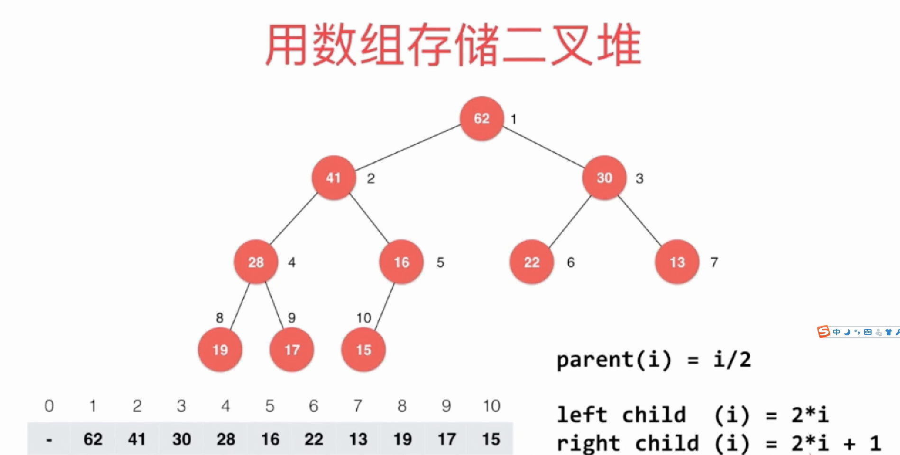
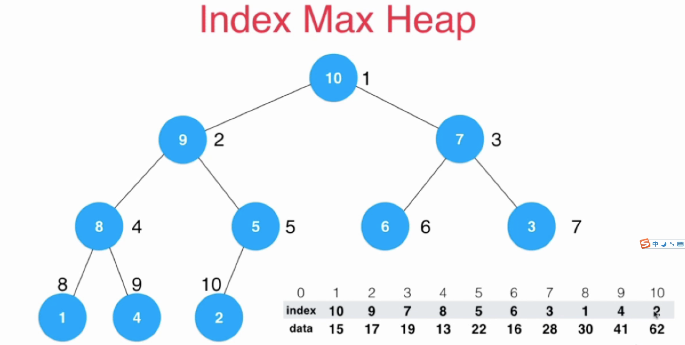

<!-- TOC -->

- [堆](#堆)
    - [思考:如何在100000个元素中选中前100名？](#思考如何在100000个元素中选中前100名)
    - [堆的定义](#堆的定义)
    - [堆的实现](#堆的实现)
    - [堆排序](#堆排序)
    - [总结](#总结)
- [索引堆](#索引堆)
    - [why?](#why)
    - [结构](#结构)

<!-- /TOC -->

### 堆
#### 思考:如何在100000个元素中选中前100名？
即在N个元素中选出前m个元素,一般排序算法是`NlogN`的时间复杂度，使用堆排序是`Nlogm`   

我们可以用数组和堆来实现优先队列，对应复杂度如下
| 复杂度 | 入队 | 出队 |
| :------: |:------: | :------: |
| 普通数组 | O(1)| O(n) |
| 顺序数组 | O(n) | O(1) |
| 堆 | O(lgn) | O(lgn)|


#### 堆的定义
堆分为最大堆和最小堆，例如**最大堆**需要满足如下两个条件
- 是一个完全二叉树
- 任何一个节点的值不大于其父节点的值

用数组来存在二叉堆   

- 最后一个非叶子节点的索引是count/2  (注:这是从数组的索引为1的位置开始存元素)


#### 堆的实现
1.任意一个已有的数组，可以对数组中的元素进行原地交换来实现一个堆，称这个过程为`heapify`，以最大堆为例，最后一个非叶子节点的位置是索引为`(N-2)/2`,从这个结点开始到第0个元素，依次遍历执行`shiftDown`的操作，从而确保了所有的节点符合了最大堆的特点。代码如下，(heapify的算法复杂度是`O(n)`)
> 数组从0开始存元素，数组的长度为N
```java
 public void heapify(T[] arr) {

        int N = arr.length;

        for (int i = (N - 2) / 2; i >= 0; i--) {
            shiftDown(arr, i, N);
        }
    }
 private void shiftDown(T[] arr, int j, int N) {

        T toShift = arr[j];

        while (2 * j + 1 < N) {

            int largerChildIndex = 2 * j + 1;


            if (largerChildIndex + 1 < N && less(arr[largerChildIndex], arr[largerChildIndex + 1])) {
                largerChildIndex++;
            }

            if (less(arr[largerChildIndex], toShift)) {
                break;
            }

            arr[j] = arr[largerChildIndex];
            j = largerChildIndex;
        }

        arr[j] = toShift;

    }
```
2.当一个最大堆构造好，增加一个新元素时，首先将元素放置到数组的最末端，然后对该元素执行`shiftUp`操作，保证这个数组还是最大堆，将n个元素插入到堆中的算法复杂度是`O(nlgn)`  

``` java
//k为新增元素的索引
private void shiftUp(int k) {
        while (k > 0) {
            int parentIndex = (k - 1) >> 1;
            if (arr[parentIndex].compareTo(arr[k]) > 0) {
                break;
            }
            swap(arr, parentIndex, k);
            k = parentIndex;
        }
    }
```
3.当最大堆pop出最大元素后，须将最后一个元素搬到第0个位置，然后执行`shiftDown`操作,继续保持最大堆
``` java
 public T popMax() {
        T e = arr[0];
        arr[0] = arr[N - 1];
        shiftDown(0, count - 1);
        return e;
    }
```


#### 堆排序
堆排序的过程总的分3步
- 对数组进行`heapify`调整为最大堆结构
- 将首位元素和最后一位交换
- 对首位执行`shiftDown`

``` java
 public void sort(T[] arr) {

        heapify(arr);

        for (int i = arr.length - 1; i > 0; i--) {

            swap(arr, i, 0);

            shiftDown(arr, 0, i);
        }
    }
```
#### 总结
堆排序和快排相比，虽然时间复杂度都是O(nlgn)，但是堆排序在实际使用时还是不如快排的，主要有几个方面
- 堆排序在元素交换时，对数组的访问不是连续的，可能从索引8,4,2,1这样访问，这对计算机缓存不友好
- 对于初始有序的数组低效，`heapify`的过程会将顺序重新打乱，这会反而变的低效。    

堆的实际应用场景如下
- 求一组数据中的topK问题
- 求中位数、1/3类似的问题(分大顶堆和小顶堆)
- 作为优先队列使用

### 索引堆
#### why?
当这个堆数组中存的是一个比较大的元素，比如是很长的字符串，在构建堆交换元素过程中会很浪费性能，所以可以增加一个数组存放索引，在堆化的过程中交换这个索引数组里面的元素即可。
#### 结构
