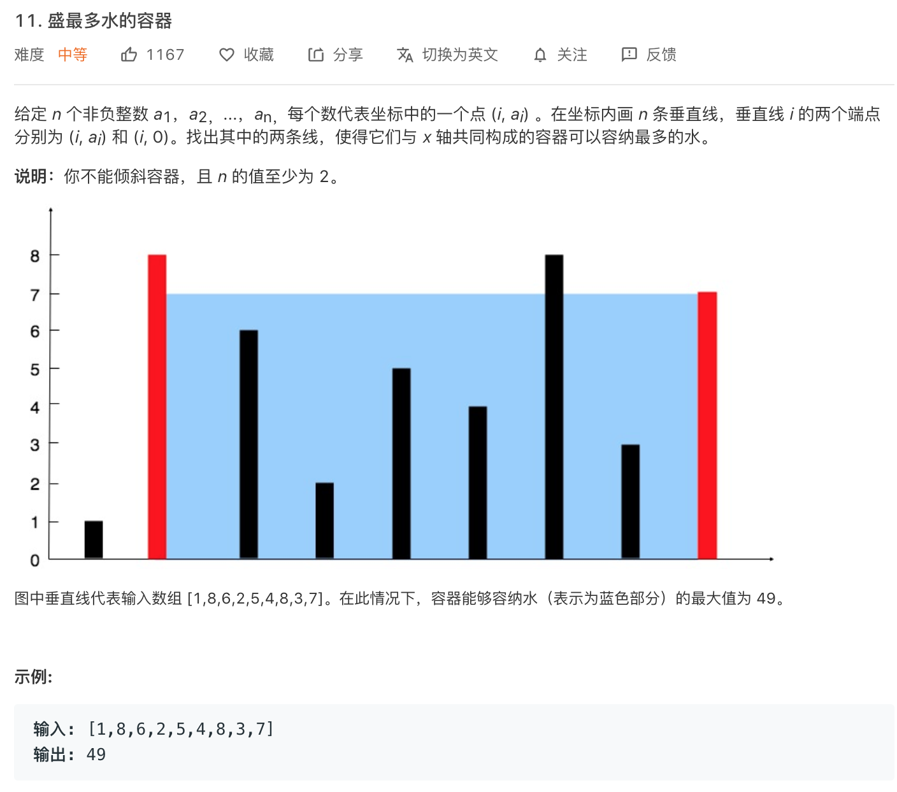

### 这个问题本质上就是输入两个变量x,y，求f(x,y)的最大值

- 方法1：暴力破解，所有的组合都遍历计算一下，比较得出最大值。复杂度O(n^2)
- 方法2：    
可以思考一下，怎么减少计算的次数，比如以第一个垂直线为基准，从右向左一旦找到离它最远的，且高度大于它的那条边，它就贡献出了它的最大记录，后面的计算可以忽略它的存在了，如果后面的那条垂直线高度还小于它，则忽略右边的(它贡献它的最大可能)，继续向左遍历。
所以两个指针，一个最左边开始，一个从右边开始，每次计算和比较，都能pk一个下去，后面不再参与计算，从将时间复杂度降为O(n)
``` java
class Solution
{
    public int maxArea(int[] height)
    {
        int l = 0, r = height.length - 1;
        int maxArea = 0;
        while (l < r)
        {
            maxArea = Math.max(maxArea, (r - l) * Math.min(height[l], height[r]));
            if (height[l] < height[r])
            {
                l++;
            } else
            {
                r--;
            }
        }
        return maxArea;
    }
}
```