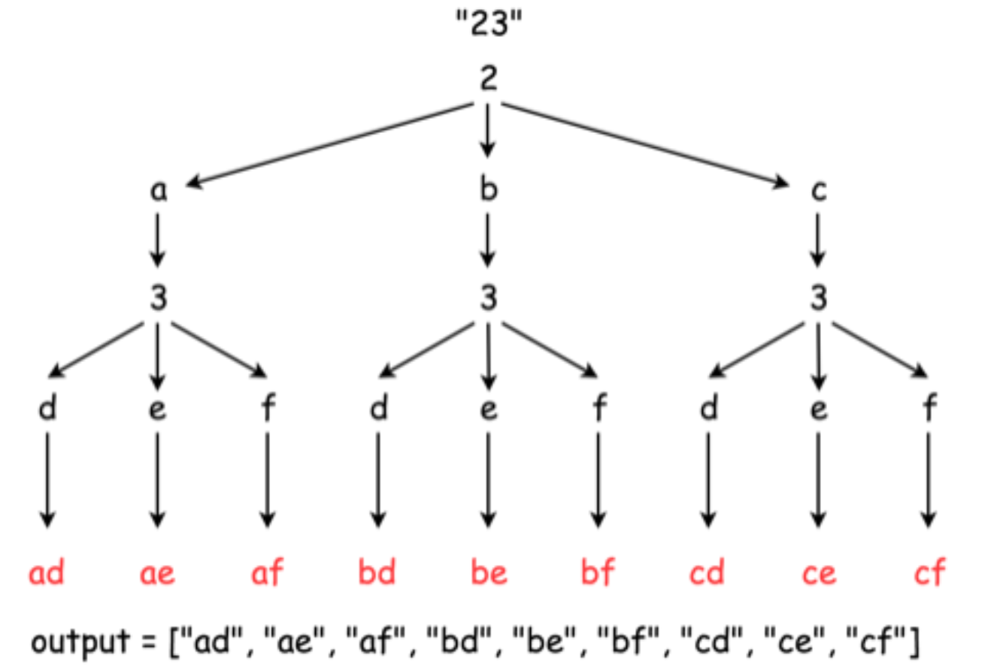

### 17. 电话号码的字母组合

<p>给定一个仅包含数字&nbsp;<code>2-9</code>&nbsp;的字符串，返回所有它能表示的字母组合。</p>

<p>给出数字到字母的映射如下（与电话按键相同）。注意 1 不对应任何字母。</p>

<p></p>

<p><strong>示例:</strong></p>

<pre><strong>输入：</strong>&quot;23&quot;
<strong>输出：</strong>[&quot;ad&quot;, &quot;ae&quot;, &quot;af&quot;, &quot;bd&quot;, &quot;be&quot;, &quot;bf&quot;, &quot;cd&quot;, &quot;ce&quot;, &quot;cf&quot;].
</pre>

<p><strong>说明:</strong><br>
尽管上面的答案是按字典序排列的，但是你可以任意选择答案输出的顺序。</p>
<div><div>Related Topics</div><div><li>字符串</li><li>回溯算法</li></div></div>

------------   
------------
### 思路
如图假设输入`23`，即`2`和`3`所对应字母的全排列问题，无须剪枝优化。

``` java
  class Solution {

        Map<Character, String> phone = new HashMap<Character, String>() {
            {
                put('2', "abc");
                put('3', "def");
                put('4', "ghi");
                put('5', "jkl");
                put('6', "mno");
                put('7', "pqrs");
                put('8', "tuv");
                put('9', "wxyz");
            }
        };

        List<String> result = new ArrayList<>();

        public List<String> letterCombinations(String digits) {

            if (digits == null || digits.isEmpty()) {
                return result;
            }
            backTrack(digits, "");

            return result;
        }

        public void backTrack(String digits, String combinedLetter) {

            if (digits.isEmpty()) {
                result.add(combinedLetter);
                return;
            }

            String letters = phone.get(digits.charAt(0));
            for (int i = 0; i < letters.length(); i++) {
                String letter = letters.substring(i, i + 1);
                backTrack(digits.substring(1), combinedLetter + letter);
            }
        }
    }
```

