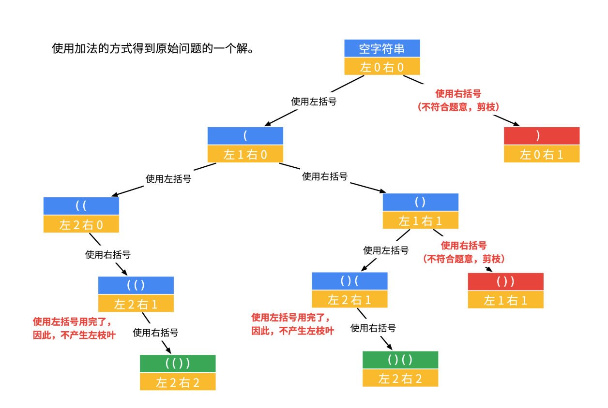

### 22.括号生成

<p>给出&nbsp;<em>n</em>&nbsp;代表生成括号的对数，请你写出一个函数，使其能够生成所有可能的并且<strong>有效的</strong>括号组合。</p>

<p>例如，给出&nbsp;<em>n </em>=<em> </em>3，生成结果为：</p>

<pre>[
  &quot;((()))&quot;,
  &quot;(()())&quot;,
  &quot;(())()&quot;,
  &quot;()(())&quot;,
  &quot;()()()&quot;
]
</pre>
<div><div>Related Topics</div><div><li>字符串</li><li>回溯算法</li></div></div>

---
---
### 思路
使用回溯算法，寻找到剪枝条件
- 左括号和右括号的数量都小于等于`n`
- 路径上左括号的数量`l`小于右括号的数量`r`时，已经无法满足条件，需要剪掉。


``` java
class Solution {
        public List<String> generateParenthesis(int n) {
            List<String> res = new ArrayList<>();

            backTrace(res, "", 0, 0, n);
            return res;
        }

        private void backTrace(List<String> res, String path, int l, int r, int n) {

            if (l == n && r == n) {
                res.add(path);
                return;
            }

            if (l < r) {
                return;
            }

            if (l < n) {
                backTrace(res, path + "(", l + 1, r, n);
            }

            if (r < n) {
                backTrace(res, path + ")", l, r + 1, n);
            }

        }
}
```