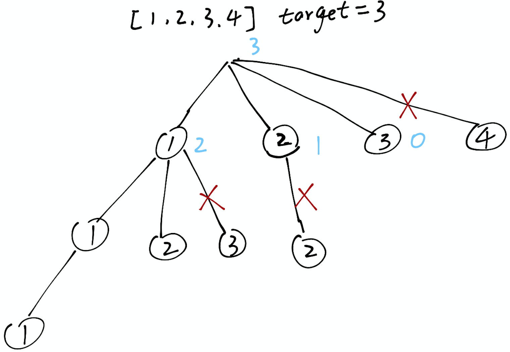

### 39.组合总和
<p>给定一个<strong>无重复元素</strong>的数组&nbsp;<code>candidates</code>&nbsp;和一个目标数&nbsp;<code>target</code>&nbsp;，找出&nbsp;<code>candidates</code>&nbsp;中所有可以使数字和为&nbsp;<code>target</code>&nbsp;的组合。</p>

<p><code>candidates</code>&nbsp;中的数字可以无限制重复被选取。</p>

<p><strong>说明：</strong></p>

<ul>
	<li>所有数字（包括&nbsp;<code>target</code>）都是正整数。</li>
	<li>解集不能包含重复的组合。&nbsp;</li>
</ul>

<p><strong>示例&nbsp;1:</strong></p>

<pre><strong>输入:</strong> candidates = <code>[2,3,6,7], </code>target = <code>7</code>,
<strong>所求解集为:</strong>
[
  [7],
  [2,2,3]
]
</pre>

<p><strong>示例&nbsp;2:</strong></p>

<pre><strong>输入:</strong> candidates = [2,3,5]<code>, </code>target = 8,
<strong>所求解集为:</strong>
[
&nbsp; [2,2,2,2],
&nbsp; [2,3,3],
&nbsp; [3,5]
]</pre>
<div><div>Related Topics</div><div><li>数组</li><li>回溯算法</li></div></div>

----
----
### 思路
递归回溯问题，重要关注两个问题
- 如何剪枝
- 如何去除重复解

假设`candidates = [1,2,3,4], target = 3,`，示意图如下

- 先对数组排序
- 每一层遍历进入`path`的元素应小于target
- 进入递归后的target为`target-candidates[i]`
- 因为需要去重，进入递归后的初始遍历索引为`i`
``` java
class Solution {

        public List<List<Integer>> combinationSum(int[] candidates, int target) {

            List<Integer> path = new ArrayList<>();
            List<List<Integer>> res = new ArrayList<>();
            Arrays.sort(candidates);

            backTracking(candidates, 0, target, path, res);
            return res;
        }

        private void backTracking(int[] candidates, int begin, int target, List<Integer> path, List<List<Integer>> res) {
            if (target == 0) {
                res.add(new ArrayList<>(path));
            } else {
                for (int i = begin; i < candidates.length; i++) {

                    if (target < candidates[i]) break;

                    path.add(candidates[i]);
                    backTracking(candidates, i, target - candidates[i], path, res);
                    path.remove(path.size() - 1);
                }
            }
        }
    }
```

