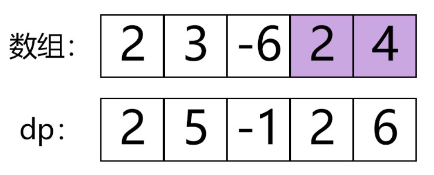

### 53.最大子序和
<p>给定一个整数数组 <code>nums</code>&nbsp;，找到一个具有最大和的连续子数组（子数组最少包含一个元素），返回其最大和。</p>

<p><strong>示例:</strong></p>

<pre><strong>输入:</strong> [-2,1,-3,4,-1,2,1,-5,4],
<strong>输出:</strong> 6
<strong>解释:</strong>&nbsp;连续子数组&nbsp;[4,-1,2,1] 的和最大，为&nbsp;6。
</pre>

<p><strong>进阶:</strong></p>

<p>如果你已经实现复杂度为 O(<em>n</em>) 的解法，尝试使用更为精妙的分治法求解。</p>
<div><div>Related Topics</div><div><li>数组</li><li>分治算法</li><li>动态规划</li></div></div>


---
---


### 思路
- 动态规划：     

`dp[i]`表示以`nums[i]`结尾的最大子序和    
当`dp[i]<=0`时，`dp[i+1]=nums[i+1]`   
当`dp[i]>0`时，`dp[i+1]=dp[i]+nums[i+1]`
最后求出`dp[i]`的最大值即可

``` java
class Solution {
        public int maxSubArray(int[] nums) {
            //dp[i] means the largest sum among the subarrays whose last element is nums[ i].
            int dp[] = new int[nums.length];
            int max = nums[0];
            dp[0] = nums[0];

            for (int i = 1; i < nums.length; i++) {
                //dp[i] = dp[i - 1] < 0 ? nums[i] : dp[i - 1] + nums[i];
                dp[i] = Math.max(dp[i - 1] + nums[i], nums[i]);
                max = Math.max(max, dp[i]);
            }
            return max;
        }
    }
```
- 分治法
>TODO
- 贪心法
>TODO