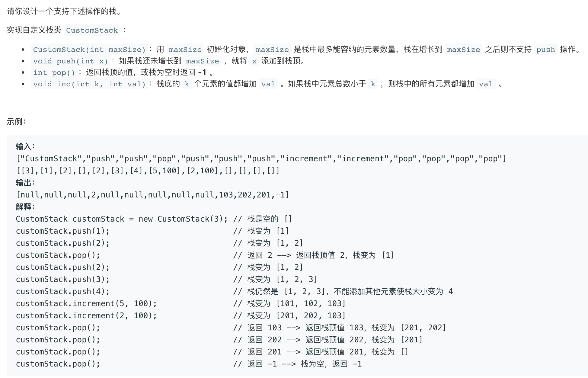

### 5357. 设计一个支持增量操作的栈



---
---


### 思路
第一次参加周赛的题目，也是唯一会做的，没啥好说的，呵呵。
``` java
class CustomStack {
    
    private int[] arr;

    private int top = -1;

    public CustomStack(int maxSize) {
        arr = new int[maxSize];
    }

    public void push(int x) {
        if (top == arr.length - 1) return ;

        arr[++top] = x;
    }

    public int pop() {
        if (top == -1) return -1;

        return arr[top--];
    }

    public void increment(int k, int val) {
        for (int i = 0; i < k && i <= top; i++) {
            arr[i] += val;
        }
    }
}
```