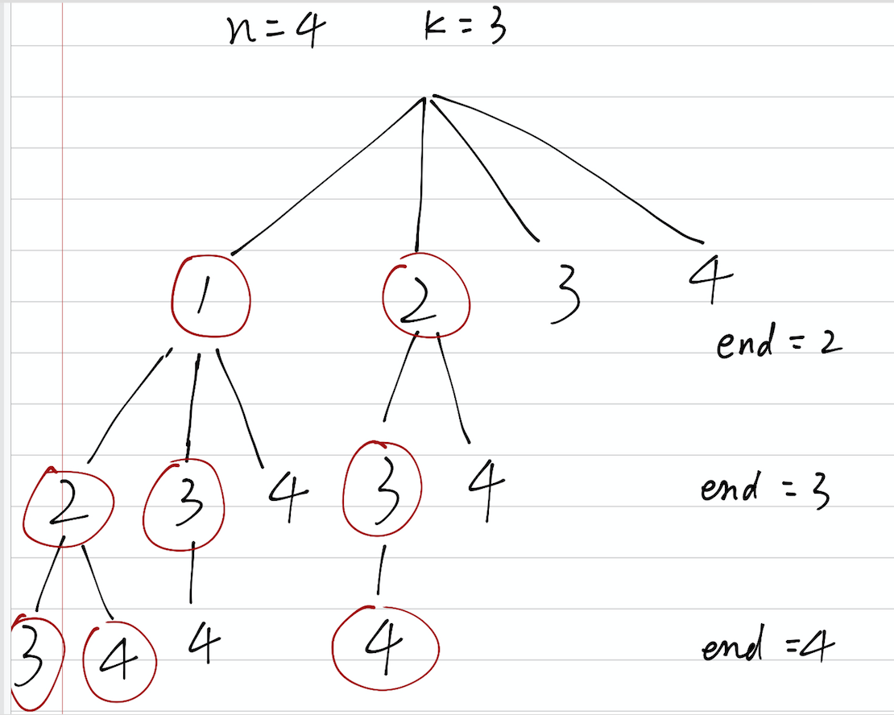

### 77.组合
<p>给定两个整数 <em>n</em> 和 <em>k</em>，返回 1 ... <em>n </em>中所有可能的 <em>k</em> 个数的组合。</p>

<p><strong>示例:</strong></p>

<pre><strong>输入:</strong>&nbsp;n = 4, k = 2
<strong>输出:</strong>
[
  [2,4],
  [3,4],
  [2,3],
  [1,2],
  [1,3],
  [1,4],
]</pre>
<div><div>Related Topics</div><div><li>回溯算法</li></div></div>

-------

### 思路
假设`n=4,k=3`，则有效的路径如图红圈，递归到第二层后就相当于还需取`k-1`个数,要保证待选择数目大于等于需求个数，所以递归的时候可以保证`n-lastIndex>=k-1`来减少无意义的递归。


``` java
class Solution
    {
        List<List<Integer>> res = new ArrayList<List<Integer>>();

        public List<List<Integer>> combine(int n, int k)
        {
            trackBack(n, 1, new ArrayList<Integer>(), k);
            return res;
        }

        private void trackBack(int n, int begin, List<Integer> path, int k)
        {
            if (k == 0)
            {
                res.add(new ArrayList<Integer>(path));
                return;
            }

            for (int i = begin; i <= n - k + 1; i++)
            {
                path.add(i);
                trackBack(n, i + 1, path, k - 1);
                path.remove(path.size() - 1);
            }
        }

      //or
        private void backTrace(int start, List<Integer> path) {

            if (path.size() == k) {
                res.add(new LinkedList<>(path));
                return;
            }
            for (int i = start; i <= n - k + path.size() + 1; i++) {
                path.add(i);
                backTrace(i + 1, path);
                path.remove(path.size() - 1);
            }
        }
    }
```