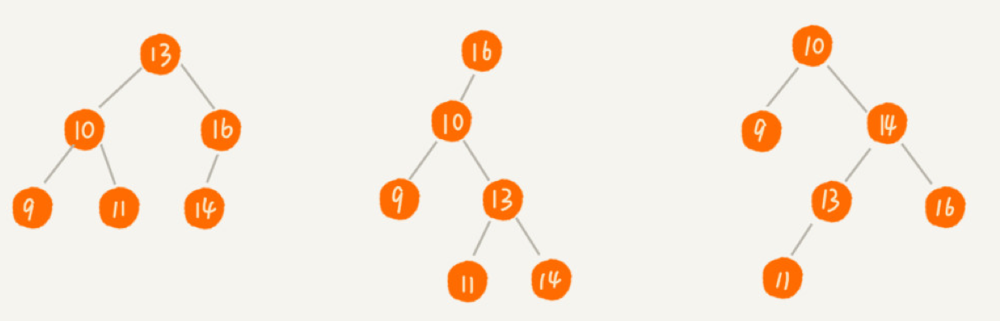

<!-- TOC -->

- [二分搜索树](#二分搜索树)
    - [思考：如何统计一本书中一个单词出现的频率？](#思考如何统计一本书中一个单词出现的频率)
    - [定义](#定义)
    - [操作](#操作)
        - [创建](#创建)
        - [查找](#查找)
        - [增加](#增加)
        - [删除](#删除)
    - [二分搜索树VS哈希表](#二分搜索树vs哈希表)

<!-- /TOC -->

### 二分搜索树

#### 思考：如何统计一本书中一个单词出现的频率？

#### 定义
对于树中的每个节点
- 其左子树中的每个节点的值都小于该节点的值
- 其右子树中的每个节点的值都大于该节点的值   

#### 操作
##### 创建
##### 查找
##### 增加
##### 删除

#### 二分搜索树VS哈希表
散列表在插入、删除和查找等运算上最快可以达到O(1)的效率，为什么还需要二分查找树呢？
- 散列表是无序的，如果需要输出有序的元素，只需要对二分查找树进行中序遍历即可
- 散列表在插入时遇到哈希冲突、或数组扩容时会不稳定，但平衡二叉查找树可以将时间复杂度稳定在O(lgn)
- 散列表的构造要复杂，包括需要考虑扩容、缩容，散列函数设计等
- 二叉树有可能退化成链表结构，平衡二叉树--红黑树可以解决这个问题。