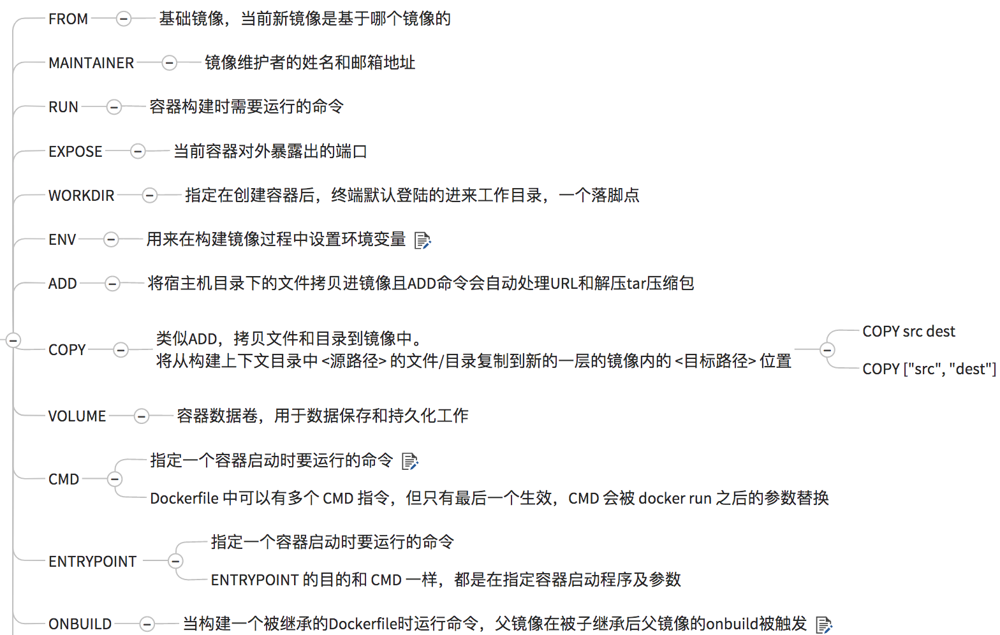

<!-- TOC -->

- [Docker 常用命令](#docker-常用命令)
    - [一、帮助命令](#一帮助命令)
    - [二、镜像命令](#二镜像命令)
    - [三、容器命令](#三容器命令)
    - [四、Docker 容器数据卷](#四docker-容器数据卷)
    - [五、DockerFile解析](#五dockerfile解析)
    - [六、推送](#六推送)
    - [END](#end)

<!-- /TOC -->
## Docker 常用命令
### 一、帮助命令
 ``` 
 docker version
 docker info 
 docker --help
 ```

### 二、镜像命令
查看镜像   
`docker images [options]`
- -a :列出所有本地镜像
- -q :只显示镜像ID
- --digests :显示摘要信息
- --no-trunc :显示完整的镜像信息

搜索镜像   
`docker search [imageId] [options]`
- -s ：指定收藏数
- --automated: 只列出automated build类型的镜像

拉取镜像   
`docker pull 镜像名:TAG`

删除镜像   
- `docker rmi -f 镜像ID`
- `docker rmi -f 镜像名1:TAG 镜像名2:TAG `
- `docker rmi -f $(docker images -qa)` --删除所有镜像

基于容器创建新的镜像
`docker commit -a='taiyuejie' -m='add somethings ' 容器ID 新镜像名:[TAG]`  

创建一个TAG  
`docker tag [ImageId] 容器名:TAG`

列出镜像变更的历史  
`docker history 镜像名`

### 三、容器命令
新建并运行容器
`docker run [OPTIONS] IMAGE [COMMAND]`
- OPTIONS说明
  - --name="容器名"
  - -d ,表示后台
  - -i ,表示交互
  - -t ,分配一个伪终端
  - -p ,指定和宿主机的映射端口
    - ip:hostPort:containerPort
    - ip::containerPort
    - hostPort:containerPort
    - containerPort
  - -P ,随机分配端口

列出正在运行的容器
`docker ps [OPTIONS]`
- -a，列出正在运行的和历史上运行的
- -l,最近创建的
- -n,最近创建的n个
- -q,静默，只显示编号
- --no-trunc,不截断输出

例如启动一个centos   
`docker run -it centos /bin/bash`

退出容器
- exit
- ctrl+p,ctrl+q,容器后台运行

启动容器   
`docker start 容器ID/容器名`

重启容器   
`docker restart 容器ID/容器名`

停止容器  
- `docker stop 容器ID/容器名`
- `docker kill 容器ID/容器名` ,rude way

删除已停止的容器  
- `docker rm 容器ID`
- `docker rm -f $(docker ps -a -q)`
- `docker ps -a -q | xargs docker rm `

查看容器日志  
`docker log -tf --tail 10 容器ID`  
- -t，加入时间戳
- -f,跟随最新的日志
- --tail 数字，显示最后多少条

查看容器运行的进程  
`docker top 容器ID`  

查看容器内部细节  
`docker inspect 容器ID`        

与运行的容器交互   
- `docker exec -it 容器ID bashShell`,不进入容器,返回shell执行的结果  
- `docker attach 容器ID`,进入容器

拷贝文件   
`docker cp 容器ID:容器路径 目的主机路径`

### 四、Docker 容器数据卷
用处：   
- 容器之间共享数据
- 容器的持久化，生命周期持续到没有容器使用它
- 可以继承

`docker run -it -v /data1:/data1InContainer centos /bin/bash`    
`docker run -it -v /宿主机绝对路径:/容器绝对路径:ro 镜像名` ,带权限   

也可以在DockerFile中指定
```
# volume test

FROM centos

VOLUME ["/dataVolumeContainer1","/dataVolumeContainer2"]

CMD echo "finished,--------success1"

CMD /bin/bash
```
通过`docker inspect 容器ID`可以查看映射到宿主机的目录，一般是`/var/lib/docker/volumes/...`

> 注:如果Docker挂载主机目录时出现cannot open directory .: Permission denied   
> 解决办法：在挂载目录后多加一个--privileged=true参数即可

继承数据卷容器  
step1:启动数据卷容器dc01  
`docker run -it --name dc01 mycentos` 
step2:继承dc01  
`docker run -it --name dc02 --volumes-from dc01 mycentos`  

### 五、DockerFile解析   


新建一个容器  
step1.在起始文件夹中准备相关文件，并创建Dockerfile  
``` shell
FROM         centos
MAINTAINER    tyj<tyj@126.com>
#把宿主机当前上下文的c.txt拷贝到容器/usr/local/路径下
COPY c.txt /usr/local/cincontainer.txt
#把java与tomcat添加到容器中
ADD jdk-8u171-linux-x64.tar.gz /usr/local/
ADD apache-tomcat-9.0.8.tar.gz /usr/local/
#安装vim编辑器
RUN yum -y install vim
#设置工作访问时候的WORKDIR路径，登录落脚点
ENV MYPATH /usr/local
WORKDIR $MYPATH
#配置java与tomcat环境变量
ENV JAVA_HOME /usr/local/jdk1.8.0_171
ENV CLASSPATH $JAVA_HOME/lib/dt.jar:$JAVA_HOME/lib/tools.jar
ENV CATALINA_HOME /usr/local/apache-tomcat-9.0.8
ENV CATALINA_BASE /usr/local/apache-tomcat-9.0.8
ENV PATH $PATH:$JAVA_HOME/bin:$CATALINA_HOME/lib:$CATALINA_HOME/bin
#容器运行时监听的端口
EXPOSE  8080
#启动时运行tomcat
# ENTRYPOINT ["/usr/local/apache-tomcat-9.0.8/bin/startup.sh" ]
# CMD ["/usr/local/apache-tomcat-9.0.8/bin/catalina.sh","run"]
CMD /usr/local/apache-tomcat-9.0.8/bin/startup.sh && tail -F /usr/local/apache-tomcat-9.0.8/bin/logs/catalina.out
```
step2:创建容器   
`docker build -t mytomcat9`  

step3:运行  
`docker run -it -d -p 8888:8080 --name mytomcat -v /data1:/data1Container --privileged=true mytomcat9`   

### 六、推送   
`docker login --username=用户名`  
`docker push NAME:TAG`

### END