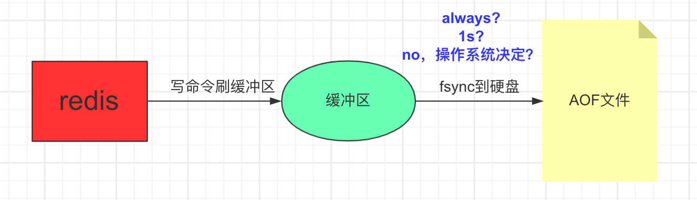

# 持久化的方式

## RDB
类似快照的方式,dump一个二进制的文件。恢复数据的时候只要加载这个二进制文件即可。
### 触发
- save（同步）
- bgsave（异步）
  - (background)后台fork一个子进程，由子进程去生成这个rdb文件。
  - fork阶段如果很慢的话，会阻塞到redis主进程
  - 比save优势体现在不阻塞客户端命令，但是fork会消耗内存
- 自动
  - 命令 `save [seconds] [changes]`，如`saven 300 10`表示在300s内发生了10次数据更改就写rdb文件。    


- 其他触发条件
  - 全量复制
  - dubug reload
  - shutdown

### 最佳配置
``` properties
dbfilename dump-${port}.rdb
dir /bigdiskpath
stop-writes-on-bgsave-error yes
rdbcompression yes
rdbchecksum yes
```
### 缺点
- 耗时,耗性能: 数据量大的话，写IO耗时，fork子进程也需要额外的空间。
- 丢失数据： 可能丢失最后一次dump时间点之后再写入的数据。
## AOF
追加写日志的方式记录写操作序列。
### 三种策略
- always：IO开销比较大
- everysec:系统默认的是1s，也就是最坏可能丢失1s内写入的数据，一般默认采用这种方式。
- no: 由操作系统决定什么时候从缓存刷到文件里，不可控。

### AOF重写
目的：
- 减少磁盘占用量
- 加速恢复速度
两种方式
- bgrewriteaof，过程类似于`bgsave`,fork一个子进程去读内存数据，然后重写AOF文件。
- AOF重写配置，配置`auto-aof-rewrite-min-size`配置项等。

### 缺点
- 数据量比较大的时候，恢复效率低
- AOF文件越来越大，通过AOF重写解决。

### 配置
``` properties
appendonly yes
appendfilename 'appendonly-${port}.aof'
appendfsync everysec
dir /bigdiskpath
no-appendfsync-on-rewrite yes # 在重写的时候，不记录操作。如果记录的话可能会造成本次重写失败。
auto-aof-rewrite-percentage 100
auto-aof-rewrite-min-size 64mb  
```
## RDB和AOF取舍
RDB恢复数据快，但会丢失数据。AOF可以做到只丢失1s的数据，但是恢复的速度慢，需要执行一条条指令。