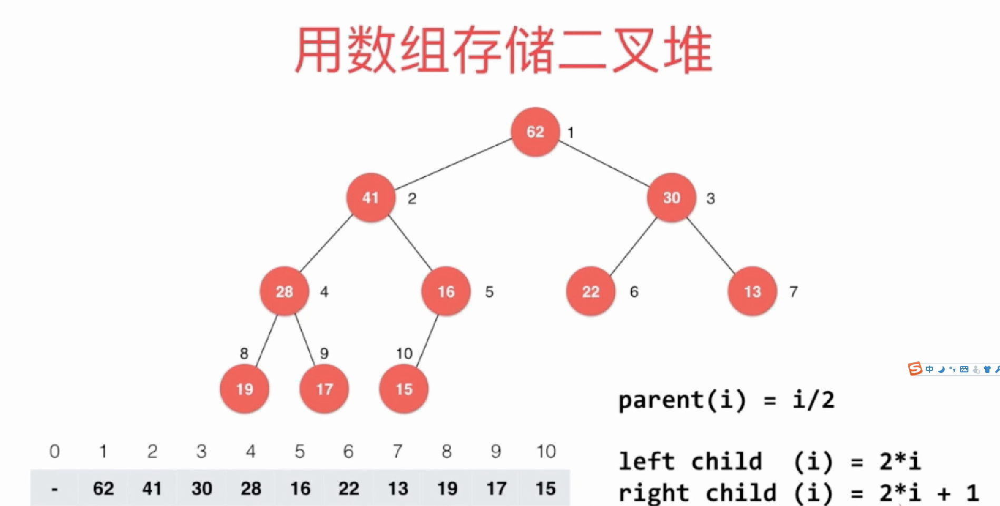

<!-- TOC -->

- [堆](#堆)
    - [思考:如何在100000个元素中选中前100名？](#思考如何在100000个元素中选中前100名)
    - [堆的定义](#堆的定义)
    - [堆的实现](#堆的实现)
    - [堆排序](#堆排序)

<!-- /TOC -->

### 堆
#### 思考:如何在100000个元素中选中前100名？
即在N个元素中选出前m个元素,一般排序算法是`NlogN`的时间复杂度，使用堆排序是`Nlogm`   

我们可以用数组和堆来实现优先队列，对应复杂度如下
| 复杂度 | 入队 | 出队 |
| :------: |:------: | :------: |
| 普通数组 | O(1)| O(n) |
| 顺序数组 | O(n) | O(1) |
| 堆 | O(lgn) | O(lgn)|

#### 堆的定义
堆分为最大堆和最小堆，例如**最大堆**需要满足如下两个条件
- 是一个完全二叉树
- 任何一个节点的值不大于其父节点的值

用数组来存在二叉堆   

- 最后一个非叶子节点的索引是count/2  (注:这是从数组的第一个位置开始存元素)

#### 堆的实现

可以通过数组的原地交换来实现一个堆   

#### 堆排序

将n个元素插入到堆中的算法复杂度是`O(nlgn)`  
heapify的算法复杂度是`O(n)`

