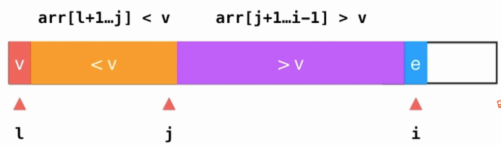
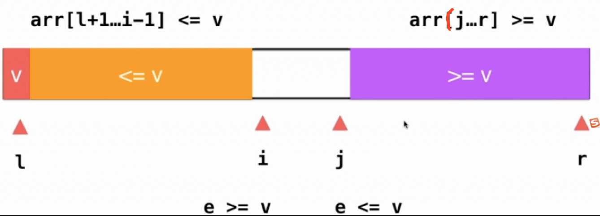
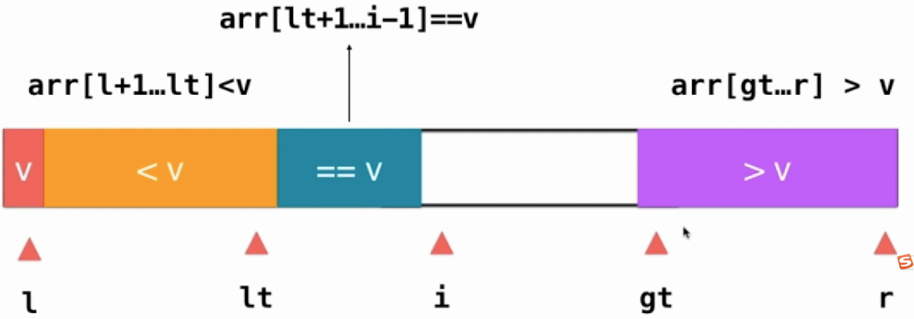

<!-- TOC -->

- [快速排序](#快速排序)
    - [单路遍历](#单路遍历)
    - [待优化点](#待优化点)
    - [优化1:双路遍历](#优化1双路遍历)
    - [三路排序](#三路排序)
    - [总结](#总结)
    - [如何求一个数组的中的第n大的数？](#如何求一个数组的中的第n大的数)
- [归并排序](#归并排序)
    - [如何求一个数组中的逆序对？](#如何求一个数组中的逆序对)

<!-- /TOC -->
### 快速排序

**基本思想：**  
选择一个元素想『办法』将其放置在数组排好序后正确的位置上，即此时左边都是小于该元素，右边都是大于该元素。然后对左边的数组和右边的数组递归的进行该办法，最后就可以得到一个有序的数组。关键在于如何实施该『办法』

#### 单路遍历

如图需将`l`指向的元素v放置到正确的位置上  
`j`指向小于v的边界上，即`j+1`指向的元素是大于v的  
`i`是遍历指针  
**流程：**`i`指向的元素如果大于v则移到下一位继续遍历，如果小于v和`j+1`指向的元素交换，同时`j`加一，`i+1`继续遍历下一位。


``` java
 public void quickSort(T[] arr, int l, int r)
    {
        if (l >= r)
        {
            return;
        }

        int partitionIndex = partitionV1(arr, l, r);

        quickSort(arr, l, partitionIndex - 1);
        quickSort(arr, partitionIndex + 1, r);
    }


    //单边排序
    public int partitionV1(T[] arr, int l, int r)
    {
        //给0位置上的元素找位置，按道理应该随机选一个的
        T v = arr[l];

        //j是小于v的边界[1,j]上的元素都是小于v的
        int j = l;

        //i遍历指针
        for (int i = l + 1; i <= r; i++)
        {
            if (less(arr[i], v))
            {
                swap(arr, j + 1, i);
                j++;
            }
        }
        swap(arr, l, j);

        return j;
    }
```
#### 待优化点

- 有序数组导致性能下降。上面的算法对于一个近似有序的数组，其时间复杂度会退化到O(n^2)，因为每次挑选的第一元素可能就是最小的，分组时会出现不均匀的情况。解决这个问题很容易，只需要在分组之前随机选一个元素和第一个元素交换一下，然后再进行快速排序。
- 过多的相等元素导致性能下降。上面的算法中，其实与第一个相等的数都被分在了右边一组，这种情况也会导致分配不均匀

#### 优化1:双路遍历
如下图所示：`i`、`j`指针分别从两边遍历，使得`arr[l+1]~arr[i-1]<=v`和`arr[j+1]~arr[r]>=v`,再交换`i`和`j`所指向的元素,这种优化方式其实是将相等的元素的匀到两边去了。


``` java
 public void quickSort(T[] arr, int l, int r)
    {
        if (l >= r)
        {
            return;
        }

        Random random = new Random(System.currentTimeMillis());
        int randomIndex = l + random.nextInt(r - l + 1);
        swap(arr, l, randomIndex);

        int partitionIndex = partitionV2(arr, l, r);

        quickSort(arr, l, partitionIndex - 1);
        quickSort(arr, partitionIndex + 1, r);
    }

 public int partitionV2(T[] arr, int l, int r)
    {
        int i = l + 1;
        int j = r;
        T v = arr[l];
        while (true)
        {
            while (i <= r && (less(arr[i], v)))
            {
                i++;
            }
            while (j >= l + 1 && (less(v, arr[j])))
            {
                j--;
            }
            if (i > j)
            {
                break;
            }
            swap(arr, i, j);

            i++;
            j--;
        }
        swap(arr, l, j);
        return j;
    }
```

#### 三路排序
三路排序的过程如下图所示，`lt`(lessthan)指向小于`v`的边界，`gt`(greaterthan)指向大于`v`的边界，中间即是相等元素，只需要将两边的元素分治即可，从而避免了相同元素的重复计算。



``` java
    public void quickSort3Ways(T[] arr, int l, int r)
    {
        if (l >= r)
        {
            return;
        }

        Random random = new Random(System.currentTimeMillis());
        int randomIndex = l + random.nextInt(r - l + 1);
        swap(arr, l, randomIndex);

        T v = arr[l];
        int lt = l;//arr[l+1...lt]<v
        int gt = r + 1;//arr[gt...r]>v
        int i = l + 1;
       
        while (i < gt)
        {
            if (less(arr[i], v))
            {
                swap(arr, i, lt + 1);
                i++;
                lt++;
            } else if (less(v, arr[i]))
            {
                swap(arr, i, --gt);
            } else
            {
                i++;
            }
        }
        swap(arr, l, lt);

        quickSort3Ways(arr, l, lt - 1);
        quickSort3Ways(arr, gt, r);
    }
```


#### 总结
单路排序实现很简单但是在两种场景下，性能会急剧下降。
- 数组的初始顺序是接近有序时
- 当数组中存在大量的重复元素时。

针对第一个问题，可以随机选择一个元素和首位交换后再分治排序可以很大概率解决，双路排序可以稍微优化一下第二个问题，但是解决的不够充分，只不过分治的均匀些，但还是有重复计算的可能，三路排序可以很好解决以上两个问题。
> tip:写程序时一定要参考排序过程中的瞬态示意图，根据瞬态示意图写好程序后再把几个边界检验一下即可。
#### 如何求一个数组的中的第n大的数？

### 归并排序

#### 如何求一个数组中的逆序对？